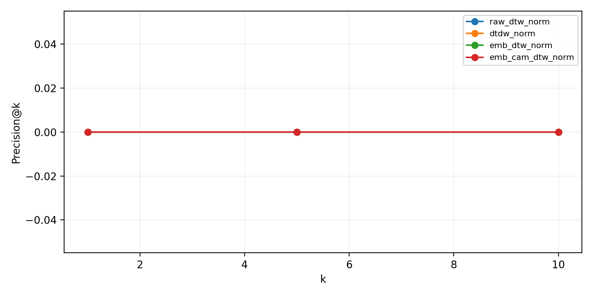

# Experiment Interpretation

이 문서는 `outputs/metrics`, `outputs/posthoc`, `outputs/cdew`, `outputs/concepts`에 저장된 CSV/PNG 산출물을 함께 읽기 위한 **GitHub용 해석 README**다.  
핵심 목적은 “무엇이 잘 되었는가”뿐 아니라, **무엇까지는 말할 수 있고 무엇은 아직 말하면 안 되는가**를 분명히 하는 것이다.

---

## TL;DR

- **DTDW**가 가장 설득력 있는 결과다.
  - `raw_dtw_norm AUC = 0.634`
  - `dtdw_norm AUC = 0.785`
  - `emb_dtw_norm AUC = 0.141`
  - `emb_cam_dtw_norm AUC = 0.147`
- 이 결과는 VIX 위험 이벤트가 단순 레벨 차이보다 **국소 분포 변화와 temporal deformation**으로 더 잘 설명된다는 뜻이다.
- **Raw DTW보다 DTDW가 event discrimination에 훨씬 유리하다.**
- 반면 **Embedding DTW / Embedding+CAM DTW**는 현재 설정대로는 낮은 AUC를 보였지만, 이는 곧바로 representation failure라기보다 **distance orientation / reference choice 문제**일 가능성이 크다.
- Post-hoc CAM은 event에서 더 앞쪽 시점에 주의를 두는 경향을 시사하지만, 표본 수와 matching 품질 문제 때문에 아직 **exploratory evidence**에 가깝다.
- TCAV / C-DEW는 아직 안정적이라고 보기 어렵다. 현재로서는 **future work 성격**이 더 강하다.

---

## Repository figure guide

아래 이미지가 저장되어 있다고 가정하고 설명한다.

```text
outputs/metrics/
  metric_auc_bar.png
  metric_boxplots.png
  metric_over_time.png
  retrieval_at_k.png

outputs/posthoc/
  mean_cam_abs.png
  mean_cam_signed.png
  com_distribution.png
  foc_distribution.png
  deletion_vs_random.png
  matching_balance_plot.png
```

GitHub README에 실제 그림을 보여주고 싶다면 아래처럼 상대경로로 넣으면 된다.

```md


```

---

## 1. 가장 중요한 결론

이 실험의 가장 강한 메시지는 다음 한 문장으로 정리할 수 있다.

> **VIX tail-risk는 pointwise level difference보다 local distributional deformation으로 더 잘 포착된다.**

즉, 이 실험은 “VIX를 얼마나 잘 맞췄는가”보다,

- **어떤 구간이 평시와 다른 위험 체제인가**
- 그 위험 체제가 **어떤 형태의 구조적 변형으로 나타나는가**

를 보는 데 더 의미가 있다.

---

## 2. Event-Warping 결과의 의미

`metric_auc.csv`와 `metric_auc_bar.png`는 이 실험에서 가장 설득력 있는 부분이다.

### AUC summary

| Metric | AUC | Interpretation |
|---|---:|---|
| `raw_dtw_norm` | 0.634 | 기본 DTW도 일정 수준 유효 |
| `dtdw_norm` | **0.785** | 가장 강한 분리력 |
| `emb_dtw_norm` | 0.141 | 현재 설정 방향으로는 낮음 |
| `emb_cam_dtw_norm` | 0.147 | CAM 가중에도 낮음 |


### 해석

여기서 핵심은 **DTDW**다.

Raw DTW보다 DTDW가 훨씬 낫다는 것은, tail event가 단순히 “레벨이 다르다”기보다 **짧은 구간의 분포 형태와 변화 구조가 다르다**는 뜻이다.

즉, VIX 이벤트를 보려면 단순 point-to-point alignment보다 **local distribution geometry**를 보는 편이 훨씬 낫다는 뜻이다.

이건 실험적으로 꽤 의미가 있다. VIX 급변 구간은 값 하나의 차이보다 오히려 다음 특성으로 나타나는 경우가 많기 때문이다.

- 변동성 군집(volatility clustering)
- 비대칭적 점프(asymmetric jumps)
- 짧은 구간 내 shape 변화

따라서 이 결과는 다음과 같이 정리할 수 있다.

> **Tail-risk episodes in VIX are better characterized by distributional temporal deformation than by raw pointwise distance.**

또는 더 직접적으로 말하면,

> **Raw DTW보다 DTDW가 event discrimination에 훨씬 유리하며, 위험 이벤트는 pointwise level difference보다 distributional shape change로 더 잘 포착된다.**

이 문장이 README에서 가장 앞에 나와도 무리가 없다.

---

## 3. `metric_over_time.png` 해석


이 그림에서 보이는 패턴은 다음과 같다.

- `raw_dtw_norm`과 `dtdw_norm`은 큰 스트레스 구간에서 함께 상승한다.
- 그러나 **DTDW가 더 크게, 더 선명하게 peak를 만든다.**
- 특히 대형 스파이크 구간에서는 DTDW가 raw DTW보다 더 민감하게 반응한다.
- `emb_dtw_norm`, `emb_cam_dtw_norm`은 전반적으로 훨씬 낮은 범위에서 움직인다.

### 해석

이 그림은 DTDW가 단순 노이즈가 아니라, 실제로 **stress regime를 더 잘 증폭해서 보여주는 score**처럼 작동한다는 점을 뒷받침한다.

- `raw_dtw_norm`: 값과 형태의 기본 차이
- `dtdw_norm`: 값 차이에 더해 **분포 변화와 국소적인 비정상성**까지 반영

따라서 DTDW는 단순 거리라기보다 **regime stress score**로 해석하는 것이 적절하다.

---

## 4. Embedding-DTW, Emb+CAM DTW의 해석

겉으로 보면 embedding 기반 metric은 “망한 것처럼” 보인다. 실제로 AUC가 `0.14` 수준이다.

- `emb_dtw_norm AUC = 0.141`
- `emb_cam_dtw_norm AUC = 0.147`

하지만 이걸 곧바로 “표현이 쓸모없다”라고 해석하면 아깝다.

### 더 자연스러운 해석

현재 결과는 오히려 다음 가능성을 시사한다.

> **embedding distance의 방향(sign) 또는 reference choice가 뒤집혀 있다.**

왜냐하면 AUC가 `0.14`라는 건 사실상 **이 점수가 event일수록 작다**는 뜻이기 때문이다.

즉 embedding space에서는 사건 구간이 reference로부터 “멀어지는” 게 아니라, 오히려 **더 가까워지는 방식으로 조직되어 있을 가능성**이 있다.

이 때문에 현재의 핵심 메시지는 다음과 같다.

- latent representation에는 **event-related structure**가 있을 수 있다.
- 하지만 현재의 scoring rule, 즉
  - **“큰 거리 = event”**
  - 또는 현재의 reference 선택
  이 맞지 않을 가능성이 크다.

따라서 이건 곧바로 **representation failure**라고 보기보다,

> **distance orientation / reference design failure**

에 더 가깝다.

즉 embedding metric의 현재 낮은 점수는 “모형 내부 표현이 무의미하다”가 아니라, **그 표현을 읽는 방법이 아직 정렬되지 않았다**는 의미일 수 있다.

---

## 5. `metric_boxplots.png` 해석


박스플롯에서는 다음이 비교적 뚜렷하다.

- `raw_dtw_norm`: event 쪽이 non-event보다 전체적으로 더 큼
- `dtdw_norm`: event 쪽 이동이 더 뚜렷함
- `emb_dtw_norm`, `emb_cam_dtw_norm`: 오히려 **event 쪽이 더 낮은 값**

### 해석

이 그림은 위의 embedding 해석을 다시 뒷받침한다.

- DTDW는 “위험 구간일수록 거리 증가”라는 직관과 맞다.
- 반면 embedding 계열은 현재 기준으로는 **반대 방향**이다.

즉 embedding 계열은 다음 중 하나일 가능성이 높다.

1. reference가 이미 event-like prototype에 가깝다.
2. latent space에서 event가 특정 anchor로 수렴한다.
3. distance 해석 방향이 뒤집혀 있다.

따라서 embedding metric은 지금 당장 버릴 대상이라기보다,

- reference 재설정
- `1 - score` 또는 sign reversal 테스트
- prototype-based reference selection

같은 후속 점검이 필요한 모듈로 보는 편이 타당하다.

---

## 6. `retrieval_at_k.png` 해석



precision@k가 전부 0이다.

### 해석

이건 AUC와 모순이라기보다, **평가 목적이 다르다**고 보는 게 맞다.

- AUC는 전체 순위 분포에서 event/non-event를 얼마나 잘 가르는지 본다.
- retrieval@k는 상위 몇 개 샘플을 정확한 event로 바로 찝는지를 본다.

현재 결과는 점수가 사건 “당일”보다 사건 전후의 **위험 체제 전체**에서 넓게 올라가기 때문에 top-k retrieval에는 약하다는 뜻이다.

즉 이 metric들은

> **alarm-onset detector**라기보다 **continuous regime detector**

에 더 가깝다.

---

## 7. Post-hoc XAI: `mean_cam_abs.png` 해석


이 그림에서 보이는 패턴은 다음과 같다.

- Event는 초반부(`t≈4`)에서 비교적 큰 peak가 나타난다.
- Control은 중후반부(`t≈9~10`, `t≈18~19`)에서 더 강한 peak가 나타난다.
- 특히 control은 마지막 구간에서 큰 CAM 상승이 있다.

### 요약 수치

- Event COM(abs) 평균: **10.09**
- Control COM(abs) 평균: **11.56**
- Event peak index 평균: **9.25**
- Control peak index 평균: **16.00**

### 해석

이 결과는 event 샘플에서 모델이 **더 이른 시점의 누적 패턴**을 참고하는 경향을 시사한다.
즉 모델은 단순히 마지막 며칠만 보는 게 아니라,

- 이벤트 이전의 buildup
- 전조 패턴
- 이미 누적된 불안정성

을 활용하고 있을 가능성이 있다.

다만 이 해석은 표본 수가 `4 pairs`뿐이므로 **정성적 힌트**로 보는 것이 맞다.

---

## 8. `mean_cam_signed.png` 해석


signed CAM에서는

- 초반부에는 양(+)의 기여
- 후반부에는 음(-)의 기여

가 나뉘는 경향이 보인다.

Event와 control 모두 비슷한 큰 틀을 공유하지만,

- control은 특정 중간 시점에서 더 sharp한 positive spike
- 후반부에서는 더 강한 negative tail

을 보인다.

### 해석

이건 모델이 과거 일부 구간을 **예측을 끌어올리는 근거**로 쓰고, 후반 일부 구간을 **보정 또는 억제 방향의 신호**로 쓸 가능성을 시사한다.

다만 signed CAM 관련 검정이 유의하지 않았으므로, 이 부분은 **설명 가설** 수준에서 해석하는 것이 적절하다.

---

## 9. `com_distribution.png` 해석


event가 control보다 더 왼쪽에 있다. 즉 COM(abs)이 더 작다.

### 해석

이는 event에서 중요도가 시간창의 앞부분에 더 실린다는 뜻이며, `mean_cam_abs.png`와 일관된다.

하지만 검정 결과는 강하지 않다.

- `p_raw ≈ 0.11`
- FDR 보정 후 유의하지 않음

따라서,

> **이벤트는 더 이른 시점을 본다**

라는 서술은 가능하지만,

> **통계적으로 확정되었다**

고 쓰기는 어렵다.

---

## 10. `foc_distribution.png` 해석


FOC(abs)는 event 평균이 control보다 약간 높다.

- Event FOC(abs) 평균: **2.91**
- Control FOC(abs) 평균: **2.63**

### 해석

이건 event 샘플에서 CAM이 약간 더 **집중적(sharper)**일 수 있음을 시사한다. 다만 분포가 겹치고 유의성도 약하다.

그래서 이 그림은

> **event에서 더 이른 시점 + 약간 더 집중적인 CAM**

이라는 정성적 힌트 정도로 읽는 것이 가장 안전하다.

---

## 11. `deletion_vs_random.png` 해석


평균값은 대략 다음과 같다.

| Group | Important deletion | Random deletion | Ratio |
|---|---:|---:|---:|
| Event | 0.0547 | 0.0506 | **1.08x** |
| Control | 0.0525 | 0.0579 | **0.91x** |

### 해석

- Event에서는 important mask가 random보다 약간 더 큰 prediction change를 만든다.
- Control에서는 중요한 위치를 지웠다고 해서 random보다 더 크게 흔들린다고 보기 어렵다.

즉,

> **CAM이 완전히 랜덤은 아니지만, faithfulness를 강하게 입증할 정도로 확실하지도 않다.**

현재 CAM은 plausibility는 있지만, causal faithfulness까지 강하게 보장한다고 말하긴 어렵다.

---

## 12. `matching_balance_plot.png` 해석


이 그림은 post-hoc event/control 비교의 가장 큰 약점을 보여준다.

- 많은 feature에서 `|SMD| > 0.1`을 크게 넘는다.
- 일부는 `|SMD| > 1` 수준이다.
- 더 나쁜 점은 matching 후 imbalance가 개선되지 않고, 오히려 **악화된 feature가 적지 않다.**

### 요약

- Mean `|SMD|` before: **0.51**
- Mean `|SMD|` after: **0.75**
- Max `|SMD|` before: **2.07**
- Max `|SMD|` after: **2.85**

### 해석

이건 매우 중요하다.

> **현재 매칭은 “비슷한 control”을 충분히 잘 찾지 못했다.**

따라서 post-hoc XAI 비교에는

- 순수한 mechanism 차이
- confounding이 섞인 기저 상태 차이

가 동시에 반영되었을 가능성이 있다.

즉 CAM 차이를 곧바로 causal mechanism difference로 일반화하면 안 된다.

---

## 13. Post-hoc 결과 전체 요약

### 말할 수 있는 것

- Event에서는 CAM 중심이 더 앞쪽에 오는 경향이 있다.
- Control은 후반부, 특히 마지막 구간에 attention이 더 몰린다.
- Event는 약간 더 focused한 CAM을 보일 가능성이 있다.

### 아직 말하면 안 되는 것

- “CAM 차이가 통계적으로 확실하다”
- “Deletion test가 faithfulness를 강하게 지지한다”
- “이 차이가 모델 메커니즘의 본질적 차이임이 입증되었다”

즉 post-hoc은 **흥미로운 패턴 발견** 수준이지, 아직 **결정적 증거**는 아니다.

---

## 14. C-DEW / TCAV 관점에서의 보수적 해석

`outputs/cdew`, `outputs/concepts`를 함께 보면, 현재 concept-based explanation은 아직 강하지 않다.

### 관찰

- `FlightToSafety` positive count: **34**
- `LiquiditySqueeze`: **0**
- TCAV CV accuracy: **약 0.51**
- TCAV CV AUC: **약 0.34**
- CAV stability cosine: fold마다 크게 흔들림
- `cdew_effects.csv`: 유의한 효과 없음

### 해석

이는 다음 가능성을 시사한다.

1. 개념 라벨 정의가 representation과 잘 맞지 않는다.
2. latent space에 개념이 선형적으로 안정적으로 박혀 있지 않다.
3. 표본 부족이나 label noise가 크다.

따라서 현재 단계에서

> **C-DEW가 의미 있는 semantic concept distance를 제공한다**

고 주장하기는 어렵다.

현재 C-DEW는 validated module이라기보다, **future work / exploratory module**에 가깝다.

---

## 15. 이 실험이 실제로 말해주는 것

이 실험에서 가장 설득력 있는 과학적 메시지는 다음과 같다.

1. **VIX 이벤트는 단순 수준(level) 차이보다 국소 분포 변화와 temporal deformation으로 더 잘 설명된다.**
2. **DTDW는 tail-risk regime score로서 유효하다.**
3. **XAI/CAM은 event에서 더 이른 시점에 주의를 둘 가능성을 보여주지만, 현재 표본과 매칭 품질로는 강한 주장까지는 어렵다.**
4. **Concept-aware 해석(C-DEW/TCAV)은 아직 representation–concept alignment가 부족하다.**

---

## 16. README에 바로 넣기 좋은 문장

### Version A

> In our experiments, distributional temporal warping (DTDW) provided the clearest separation between tail-event and non-event periods in VIX, outperforming raw DTW by a substantial margin. This suggests that VIX stress episodes are better characterized as local distributional deformations rather than simple pointwise level deviations.

### Version B

> The post-hoc CAM analysis suggests that event windows may rely more on earlier portions of the input sequence, whereas matched control windows exhibit more back-loaded attention. However, because the matched sample size is very small and balance remains imperfect, these findings should be interpreted as exploratory rather than confirmatory.

### Version C

> The concept-aware layer (TCAV/C-DEW) did not yet show stable or statistically convincing behavior, indicating that the current concept definitions and latent representations are not sufficiently aligned. At this stage, the event-warping component appears mature, while the concept-based explanation layer remains a work in progress.

---

## 17. Final take-away

이 결과를 한 문장으로 요약하면 다음과 같다.

> **이 실험은 VIX tail-risk를 “예측”보다 “구조적 변형 탐지” 문제로 볼 때 더 강한 성과를 보이며, DTDW는 유효한 위험 레짐 지표로 보이지만, XAI와 concept-based explanation은 아직 검증이 더 필요하다.**

즉,

- **앞단(Event-Warping / DTDW)은 유망**하고,
- **뒷단(Post-hoc XAI / C-DEW)은 아직 탐색적**이다.

이 프레이밍이 현재 결과를 가장 정직하고도 설득력 있게 설명한다.
