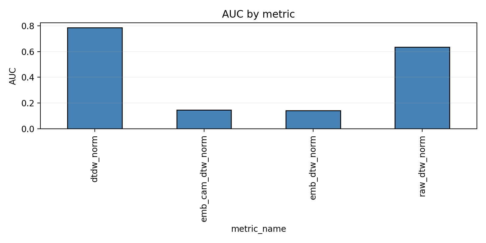
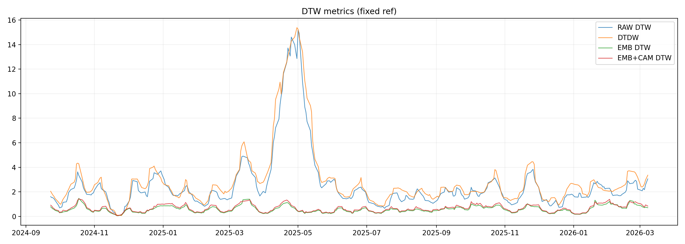
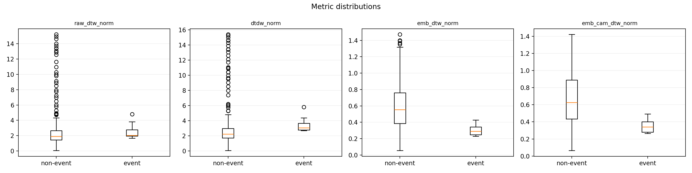
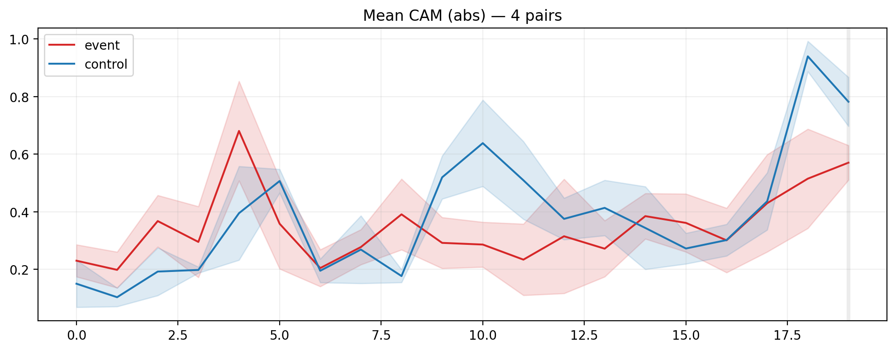
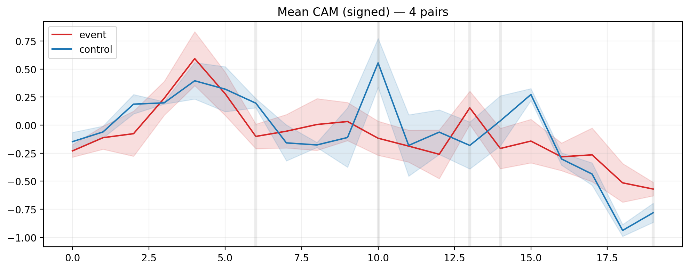
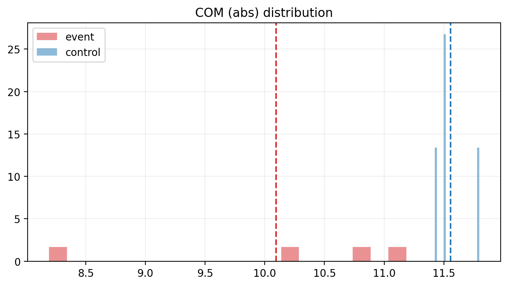
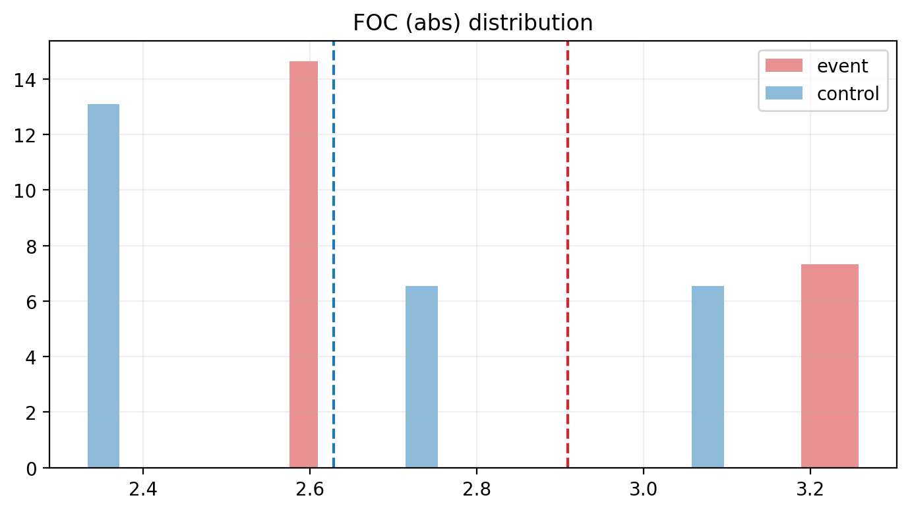
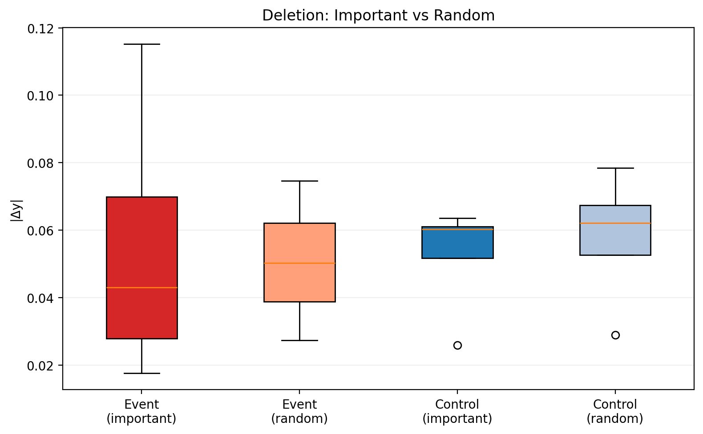
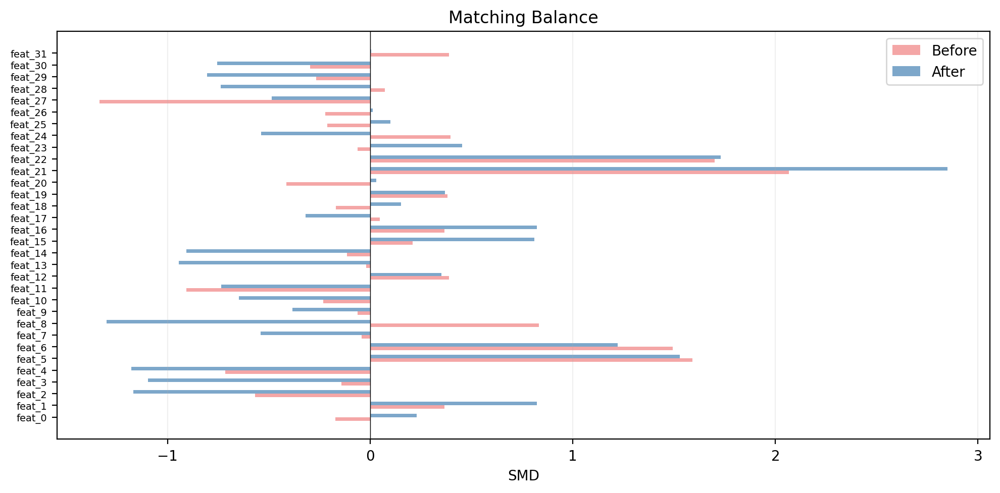

# Experiment Interpretation: VIX TCN/CNN + Event-Warping + XAI + C-DEW

이 문서는 `metrics`, `posthoc`, `concept` 관련 산출물을 한 번에 읽을 수 있도록 정리한 해석용 README다.  
핵심은 **무엇이 분명하게 말할 수 있는 결과인지**, 그리고 **아직은 탐색적 수준에 머물러야 하는 결과가 무엇인지**를 구분해서 보여주는 것이다.

---

## 한눈에 보는 결론

이번 실험에서 가장 강한 결과는 **DTDW(distributional temporal warping)** 가 이벤트 구간을 가장 잘 구분했다는 점이다.

- `raw_dtw_norm` AUC = **0.634**
- `dtdw_norm` AUC = **0.785**
- `emb_dtw_norm` AUC = **0.141**
- `emb_cam_dtw_norm` AUC = **0.147**

이 결과는 VIX tail-risk가 단순한 **레벨 차이(level difference)** 보다, **국소 분포 변화(local distributional change)** 와 **temporal deformation** 으로 더 잘 설명된다는 해석과 가장 잘 맞는다.

즉, 이번 실험의 가장 설득력 있는 메시지는 다음과 같다.

> **VIX 위험 이벤트는 pointwise level gap보다 distributional shape change와 temporal warping으로 더 잘 포착된다.**

---

## 1. 핵심 성능 비교

### AUC summary

| Metric | AUC | 95% CI | 해석 |
|---|---:|---:|---|
| `raw_dtw_norm` | **0.634** | 0.485–0.765 | 기본 DTW도 일정 수준 구분 가능 |
| `dtdw_norm` | **0.785** | 0.700–0.853 | 가장 강한 분리력 |
| `emb_dtw_norm` | **0.141** | 0.069–0.224 | 현재 방향에서는 event 점수로 부적절 |
| `emb_cam_dtw_norm` | **0.147** | 0.071–0.243 | CAM 가중 후에도 동일한 경향 |

### 해석

가장 중요한 비교는 `raw_dtw_norm` 대 `dtdw_norm` 이다.

- Raw DTW는 **값 자체의 차이**를 반영한다.
- DTDW는 여기에 더해 **짧은 구간의 분포 변화와 구조적 왜곡**까지 포착한다.

AUC가 `0.634 → 0.785`로 크게 개선된 것은, VIX 이벤트가 단순히 “값이 높아진다”는 현상보다 **국소적 변형 패턴**으로 더 잘 드러난다는 뜻이다.

따라서 DTDW는 단순 거리(metric)라기보다, **stress regime score** 로 해석하는 편이 자연스럽다.

---

## 2. 시간축에서 본 DTW 계열 metric의 동작

### 관찰 포인트

- `raw_dtw_norm`과 `dtdw_norm`은 주요 스트레스 구간에서 함께 상승한다.
- 다만 **DTDW가 더 크게**, 그리고 **더 선명하게 peak를 만든다.**
- 특히 대형 스파이크 구간에서 DTDW가 raw DTW보다 더 민감하게 반응한다.
- 반면 `emb_dtw_norm`, `emb_cam_dtw_norm`은 전반적으로 훨씬 낮은 범위에서 움직인다.

### 해석

이 그림은 DTDW가 단순히 노이즈에 반응하는 점수가 아니라, 실제로 **스트레스 체제를 더 강하게 증폭해서 보여주는 신호**처럼 작동함을 뒷받침한다.

정리하면:

- `raw_dtw_norm` = 값과 형태의 기본 차이
- `dtdw_norm` = 값 차이 + 국소 분포 변화 + temporal deformation

따라서 이벤트 탐지 관점에서는 **DTDW가 raw DTW보다 훨씬 해석 가능하고 실용적**이다.

---

## 3. 분포 관점에서 본 metric 차이

### 관찰 포인트

- `raw_dtw_norm`: event 쪽이 non-event보다 전반적으로 더 크다.
- `dtdw_norm`: event 방향 이동이 더 뚜렷하다.
- `emb_dtw_norm`, `emb_cam_dtw_norm`: 오히려 **event 쪽 값이 더 낮다.**

### 해석

이 그림은 AUC 결과를 분포 차원에서 다시 확인해 준다.

#### 3-1. Raw / DTDW 계열

- event일수록 거리가 커진다는 직관과 일치한다.
- 특히 DTDW는 event와 non-event의 위치 차이가 더 명확하다.

#### 3-2. Embedding 계열

Embedding 계열은 “성능이 낮다”기보다, 현재 정의한 점수 방향이 **거꾸로 읽히고 있을 가능성**이 크다.

즉 현재 결과는 다음 해석이 더 자연스럽다.

> **embedding space 안에는 event 관련 구조가 있을 수 있지만, 현재의 reference choice 또는 distance orientation이 event 판별 방향과 맞지 않는다.**

따라서 지금 단계에서 `emb_dtw_norm`, `emb_cam_dtw_norm`을 곧바로 “representation failure”라고 결론내리기는 이르다.  
오히려 아래와 같은 후속 점검이 필요하다.

- reference 재설정
- sign reversal (`1 - score` 또는 rank inversion) 점검
- prototype-based reference 선택
- event/non-event anchor 재정의

---

## 4. Event-warping 결과가 실제로 말해주는 것

이번 결과를 가장 짧게 요약하면 다음과 같다.

1. **VIX 이벤트는 단순한 level shift가 아니라 shape deformation에 가깝다.**
2. **DTDW는 그 deformation을 가장 잘 포착하는 score다.**
3. **따라서 event-warping 레이어는 현재 실험에서 가장 성숙한 모듈이다.**

이 문장은 README 서두나 abstract-style 요약에 그대로 넣어도 무리가 없다.

---

## 5. Post-hoc XAI: CAM이 어디를 보고 있는가

Post-hoc CAM 분석은 흥미로운 패턴을 보여주지만, **표본 수가 매우 작고(`n_pairs = 4`) matching 품질도 충분히 좋지 않다**는 점을 전제로 읽어야 한다.

### 5-1. Mean CAM (absolute)

#### 관찰 포인트

- Event는 초반부(`t≈4`)에서 상대적으로 큰 peak가 보인다.
- Control은 중후반부(`t≈9–10`, `t≈18–19`)에서 더 큰 peak가 나타난다.
- 특히 control은 마지막 구간에서 CAM이 크게 증가한다.

#### 요약 수치

- Event COM(abs) 평균: **10.09**
- Control COM(abs) 평균: **11.56**
- Event peak index 평균: **9.25**
- Control peak index 평균: **16.00**

#### 해석

이 결과는 event 샘플에서 모델이 **더 이른 시점의 누적 패턴**을 보는 경향이 있음을 시사한다.  
즉 모델은 단순히 마지막 며칠의 급등만 보는 것이 아니라,

- 이벤트 이전의 buildup
- 전조 패턴
- 이미 누적된 불안정성

을 함께 사용하고 있을 가능성이 있다.

---

### 5-2. Mean CAM (signed)

#### 관찰 포인트

- 초반부에는 양(+) 기여가 상대적으로 크고,
- 후반부에는 음(-) 기여가 늘어나는 패턴이 보인다.
- Control은 일부 중간 시점에서 sharper한 positive spike를 보이고,
- 후반부에서는 더 큰 negative tail을 보인다.

#### 해석

Signed CAM은 모델이 특정 구간을 **예측을 올리는 근거**로 사용하고, 다른 구간은 **보정 또는 억제 신호**로 사용하는 가능성을 보여준다.  
다만 이 결과는 통계적으로 강하게 입증된 것은 아니므로, 현재로서는 **설명 가설 수준**으로 보는 것이 적절하다.

---

## 6. CAM 위치와 집중도: 분포 비교

### 6-1. COM(abs) distribution

- Event 평균 COM(abs): **10.09**
- Control 평균 COM(abs): **11.56**
- 검정: `p_raw = 0.110`, `p_fdr = 1.000`, `n_pairs = 4`

### 해석

Event의 COM(abs)가 더 작다는 것은, 중요도가 시간창의 **앞부분에 더 실린다**는 뜻이다.  
이는 `mean_cam_abs.png`와 같은 방향의 결과다.

다만 `p_raw = 0.110` 이고 FDR 보정 후 유의하지 않기 때문에,

> “event가 더 이른 시점을 본다”는 **정성적 경향**은 말할 수 있지만,  
> “통계적으로 확정되었다”고 쓰기는 어렵다.

---

### 6-2. FOC(abs) distribution

- Event FOC(abs) 평균: **2.91**
- Control FOC(abs) 평균: **2.63**
- 검정: `p_raw = 0.372`, `p_fdr = 1.000`, `n_pairs = 4`

### 해석

이 결과는 event 샘플의 CAM이 control보다 약간 더 **집중적(sharper)** 일 수 있음을 시사한다.  
하지만 분포가 상당히 겹치고 통계적으로도 약하다.

따라서 이 부분은

> **“event에서는 조금 더 앞쪽, 그리고 약간 더 집중된 CAM이 보일 수 있다”**

정도의 탐색적 해석이 가장 안전하다.

---

## 7. Deletion test: CAM이 정말 중요한 위치를 짚고 있는가

### 요약 수치

| Group | Important deletion | Random deletion | Ratio |
|---|---:|---:|---:|
| Event | **0.0547** | 0.0506 | **1.08x** |
| Control | 0.0525 | **0.0579** | **0.91x** |

### 해석

- Event에서는 important mask를 지웠을 때 random deletion보다 prediction change가 약간 더 크다.
- 하지만 그 차이는 작다.
- Control에서는 오히려 important deletion이 random보다 더 강하다고 보기 어렵다.

즉,

> **CAM이 완전히 랜덤하다고 보기는 어렵지만, faithfulness를 강하게 입증한다고 보기도 어렵다.**

현재 CAM은 **plausibility는 있으나 causal faithfulness까지 강하게 보장하는 수준은 아니다.**

---

## 8. Matching quality: post-hoc 비교의 가장 큰 제약

### 요약 수치

- Mean `|SMD|` before: **0.51**
- Mean `|SMD|` after: **0.75**
- Max `|SMD|` before: **2.07**
- Max `|SMD|` after: **2.85**

### 해석

이 그림은 post-hoc CAM 비교를 해석할 때 가장 중요하게 봐야 할 제한점을 보여준다.

- 많은 feature에서 `|SMD| > 0.1` 을 크게 넘는다.
- 일부 feature는 `|SMD| > 1` 수준으로 매우 크다.
- 더 중요한 점은 matching 후에도 imbalance가 좋아지지 않았고, 일부 feature는 오히려 더 나빠졌다는 것이다.

따라서 현재 event/control CAM 차이에는

- 실제 mechanism 차이
- 기저 상태 차이에서 온 confounding

가 함께 섞여 있을 가능성이 높다.

즉,

> **현재 CAM 차이를 causal mechanism difference로 바로 일반화하면 안 된다.**

---

## 9. Post-hoc 결과를 어디까지 말할 수 있는가

### 말할 수 있는 것

- Event에서는 CAM 중심이 더 앞쪽에 오는 경향이 있다.
- Control은 상대적으로 더 뒤쪽, 특히 마지막 구간에 attention이 실리는 경향이 있다.
- Event는 약간 더 focused한 CAM을 보일 가능성이 있다.

### 아직 말하면 안 되는 것

- “CAM 차이가 통계적으로 확실하다”
- “Deletion test가 faithfulness를 강하게 입증한다”
- “이 차이는 모델 메커니즘의 본질적 차이임이 검증되었다”

즉 post-hoc XAI 결과는 **흥미로운 패턴 발견**으로는 충분히 가치가 있지만,  
현재 단계에서는 **confirmatory evidence** 가 아니라 **exploratory evidence** 로 해석하는 편이 맞다.

---

## 10. Concept-aware 해석(TCAV / C-DEW)에 대한 보수적 정리

현재 concept-aware 층은 event-warping 결과만큼 안정적이지 않다.

### 관찰 요약

- `FlightToSafety` positive count: **34**
- `LiquiditySqueeze`: **0**
- TCAV CV accuracy: **약 0.51**
- TCAV CV AUC: **약 0.34**
- CAV stability cosine: fold별 변동이 큼
- `cdew_effects.csv`: 유의한 효과 없음

### 해석

이 결과는 다음 가능성을 시사한다.

1. concept label 정의가 latent representation과 잘 맞지 않을 수 있다.
2. latent space 안에 concept가 선형적으로 안정적으로 박혀 있지 않을 수 있다.
3. 표본 수 부족 또는 label noise가 클 수 있다.

따라서 현재 단계에서는

> **C-DEW / TCAV가 의미 있는 semantic concept distance를 안정적으로 제공한다**

고 주장하기는 어렵다.  
지금은 **validated explanation layer** 라기보다 **future work에 가까운 exploratory module** 로 보는 편이 적절하다.

---

## 11. 최종 해석

이번 실험이 비교적 확실하게 말해주는 것은 다음 네 가지다.

1. **VIX 이벤트는 단순 level difference보다 local distributional deformation으로 더 잘 설명된다.**
2. **DTDW는 tail-risk regime score로 유효하다.**
3. **CAM 분석은 event에서 더 이른 시점의 정보 활용 가능성을 시사하지만, 표본 수와 matching 문제 때문에 아직 탐색적이다.**
4. **Concept-aware explanation(C-DEW / TCAV)은 아직 representation–concept alignment가 충분하지 않다.**

이를 한 문장으로 요약하면 다음과 같다.

> **이 실험은 VIX tail-risk를 ‘예측’ 문제보다 ‘구조적 변형 탐지’ 문제로 볼 때 더 강한 성과를 보이며, 그중 DTDW가 가장 유망한 위험 체제 지표로 나타났다. 반면 post-hoc XAI와 concept-based explanation은 아직 검증이 더 필요하다.**

---

## 12. README에 바로 넣기 좋은 문장

### Korean version

> 이번 실험에서 가장 강한 결과는 distributional temporal warping(DTDW)이 VIX tail-event와 non-event를 가장 잘 구분했다는 점이다. 이는 VIX 위험 구간이 단순한 값 차이보다 국소 분포 변화와 temporal deformation으로 더 잘 설명된다는 해석과 일치한다.

> Post-hoc CAM 분석은 event window에서 입력 시퀀스의 더 이른 구간이 상대적으로 중요할 가능성을 시사한다. 다만 matched pair 수가 매우 적고 balance가 충분히 확보되지 않았으므로, 이 결과는 확증적이라기보다 탐색적 증거로 해석하는 것이 적절하다.

> Concept-aware layer(TCAV / C-DEW)는 아직 안정적이거나 통계적으로 설득력 있는 패턴을 보이지 않았다. 현재 단계에서는 event-warping 모듈이 가장 성숙하며, concept-based explanation layer는 추가 검증이 필요한 상태다.

### English version

> In our experiments, distributional temporal warping (DTDW) provided the clearest separation between tail-event and non-event periods in VIX, substantially outperforming raw DTW. This suggests that VIX stress episodes are better characterized by local distributional deformation than by simple pointwise level deviation.

> Post-hoc CAM analysis suggests that event windows may rely more on earlier portions of the input sequence. However, because the matched sample is very small and covariate balance remains imperfect, these findings should be treated as exploratory rather than confirmatory.

> The concept-aware layer (TCAV / C-DEW) did not yet show stable or statistically convincing behavior. At this stage, the event-warping component appears mature, whereas the concept-based explanation layer remains a work in progress.
